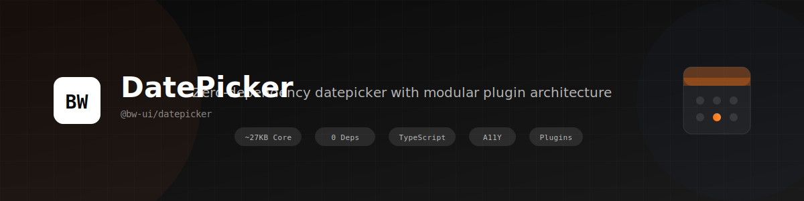

<p align="center">
  
</p>

<h3 align="center">
  Zero-dependency datepicker built for engineers who care about craft.
</h3>

<p align="center">
  Production-ready. Plugin-powered. Framework-agnostic.
</p>

<br />

<p align="center">
  <a href="https://www.npmjs.com/package/@bw-ui/datepicker"></a>
  <a href="https://bundlephobia.com/package/@bw-ui/datepicker"></a>
  <a href="https://github.com/bw-ui/bw-datepicker/blob/main/LICENSE"></a>
  <a href="https://www.npmjs.com/package/@bw-ui/datepicker"></a>
  
  
</p>

<p align="center">
  <a href="https://bw-ui.github.io/bw-datepicker"><strong>Live Demo</strong></a> · 
  <a href="#-quick-start"><strong>Quick Start</strong></a> · 
  <a href="#-packages"><strong>Packages</strong></a> · 
  <a href="#-official-plugins"><strong>Plugins</strong></a> · 
  <a href="#-api-reference"><strong>API</strong></a> · 
  <a href="#-creating-your-own-plugin"><strong>Create Plugin</strong></a>
</p>

<br />

<p align="center">
  
</p>

<br />

---

<br />

## 🤔 Why BW DatePicker?

Most datepickers are **bloated**, **hard to customize**, or **locked into a framework**.

We built something different — a datepicker that respects your bundle size, works anywhere, and lets you use only what you need.

<br />

<table>
  <tr>
    <th align="left">Feature</th>
    <th align="center">BW DatePicker</th>
    <th align="center">react-datepicker</th>
    <th align="center">flatpickr</th>
  </tr>
  <tr>
    <td>Zero dependencies</td>
    <td align="center">✅</td>
    <td align="center">❌</td>
    <td align="center">✅</td>
  </tr>
  <tr>
    <td>Modular plugins (use only what you need)</td>
    <td align="center">✅</td>
    <td align="center">❌</td>
    <td align="center">❌</td>
  </tr>
  <tr>
    <td>Works without React/Vue/Angular</td>
    <td align="center">✅</td>
    <td align="center">❌</td>
    <td align="center">✅</td>
  </tr>
  <tr>
    <td>Official React bindings</td>
    <td align="center">✅</td>
    <td align="center">✅</td>
    <td align="center">❌</td>
  </tr>
  <tr>
    <td>Full keyboard navigation</td>
    <td align="center">✅</td>
    <td align="center">⚠️ Partial</td>
    <td align="center">✅</td>
  </tr>
  <tr>
    <td>Mobile swipe gestures</td>
    <td align="center">✅</td>
    <td align="center">❌</td>
    <td align="center">❌</td>
  </tr>
  <tr>
    <td>Create custom plugins</td>
    <td align="center">✅</td>
    <td align="center">❌</td>
    <td align="center">⚠️ Limited</td>
  </tr>
  <tr>
    <td>WCAG 2.1 accessible</td>
    <td align="center">✅</td>
    <td align="center">⚠️ Partial</td>
    <td align="center">⚠️ Partial</td>
  </tr>
  <tr>
    <td>Core size (gzipped)</td>
    <td align="center"><strong>~27KB</strong></td>
    <td align="center">~40KB</td>
    <td align="center">~16KB</td>
  </tr>
</table>

<br />

---

<br />

## ✨ Features

<table>
  <tr>
    <td width="60" align="center">🪶</td>
    <td><strong>Lightweight</strong></td>
    <td>Core is only ~27KB gzipped — add only what you need</td>
  </tr>
  <tr>
    <td align="center">🔌</td>
    <td><strong>Plugin Architecture</strong></td>
    <td>10 official plugins — theming, accessibility, mobile, positioning & more</td>
  </tr>
  <tr>
    <td align="center">🎨</td>
    <td><strong>Themeable</strong></td>
    <td>Dark mode, light mode, auto-detect, CSS variables, fully customizable</td>
  </tr>
  <tr>
    <td align="center">♿</td>
    <td><strong>Accessible</strong></td>
    <td>WCAG 2.1 compliant, full keyboard navigation, screen reader support</td>
  </tr>
  <tr>
    <td align="center">📱</td>
    <td><strong>Mobile Ready</strong></td>
    <td>Touch gestures, swipe navigation, responsive design</td>
  </tr>
  <tr>
    <td align="center">🚀</td>
    <td><strong>Zero Dependencies</strong></td>
    <td>No external libraries. No supply chain risk. Just pure code.</td>
  </tr>
  <tr>
    <td align="center">📦</td>
    <td><strong>Multiple Formats</strong></td>
    <td>ESM, IIFE, CommonJS — works everywhere</td>
  </tr>
  <tr>
    <td align="center">🧩</td>
    <td><strong>Extensible</strong></td>
    <td>Create and publish your own plugins with full API access</td>
  </tr>
  <tr>
    <td align="center">⚛️</td>
    <td><strong>Framework Support</strong></td>
    <td>Official React bindings, Vue wrapper coming soon</td>
  </tr>
  <tr>
    <td align="center">🔷</td>
    <td><strong>TypeScript</strong></td>
    <td>Written in TypeScript, full type definitions included</td>
  </tr>
</table>

<br />

---

<br />

## 📦 Packages

The ecosystem is **fully modular**. Install the core and add only the plugins you need.

<br />

### Core

| Package             | Description            | Size        | Links                                                                                                                                   |
| ------------------- | ---------------------- | ----------- | --------------------------------------------------------------------------------------------------------------------------------------- |
| `@bw-ui/datepicker` | Core datepicker engine | **~27.3KB** | [](https://www.npmjs.com/package/@bw-ui/datepicker) |

<br />

### Framework Bindings

| Package                   | Description              | Size   | Links                                                                                                                                               |
| ------------------------- | ------------------------ | ------ | --------------------------------------------------------------------------------------------------------------------------------------------------- |
| `@bw-ui/datepicker-react` | React components & hooks | ~5.1KB | [](https://www.npmjs.com/package/@bw-ui/datepicker-react) |
| `@bw-ui/datepicker-vue`   | Vue 3 components         | ~4.8KB | [](https://www.npmjs.com/package/@bw-ui/datepicker-vue)     |

<br />

### Official Plugins

| Package                           | Description                                 | Size    | Links                                                                                                                                                               |
| --------------------------------- | ------------------------------------------- | ------- | ------------------------------------------------------------------------------------------------------------------------------------------------------------------- |
| `@bw-ui/datepicker-theming`       | Dark mode, light mode, CSS variables        | ~11.5KB | [](https://www.npmjs.com/package/@bw-ui/datepicker-theming)             |
| `@bw-ui/datepicker-accessibility` | Keyboard navigation, ARIA, screen readers   | ~18.8KB | [](https://www.npmjs.com/package/@bw-ui/datepicker-accessibility) |
| `@bw-ui/datepicker-positioning`   | Smart popup placement, auto-flip, collision | ~11.2KB | [](https://www.npmjs.com/package/@bw-ui/datepicker-positioning)     |
| `@bw-ui/datepicker-mobile`        | Touch gestures, swipe navigation            | ~7.5KB  | [](https://www.npmjs.com/package/@bw-ui/datepicker-mobile)               |
| `@bw-ui/datepicker-input-handler` | Input masking, manual typing, validation    | ~12.2KB | [](https://www.npmjs.com/package/@bw-ui/datepicker-input-handler) |
| `@bw-ui/datepicker-date-utils`    | Date parsing, formatting, manipulation      | ~19KB   | [](https://www.npmjs.com/package/@bw-ui/datepicker-date-utils)       |
| `@bw-ui/datepicker-locale`        | i18n, localization, translations            | ~8KB    | [](https://www.npmjs.com/package/@bw-ui/datepicker-locale)               |
| `@bw-ui/datepicker-multidate`     | Multiple date selection                     | ~8KB    | [](https://www.npmjs.com/package/@bw-ui/datepicker-multidate)         |
| `@bw-ui/datepicker-range`         | Date range selection                        | ~9KB    | [](https://www.npmjs.com/package/@bw-ui/datepicker-range)                 |
| `@bw-ui/datepicker-dual-calendar` | Side-by-side month view                     | ~10KB   | [](https://www.npmjs.com/package/@bw-ui/datepicker-dual-calendar) |
| `@bw-ui/datepicker-data`          | Data binding & state management             | ~6KB    | [](https://www.npmjs.com/package/@bw-ui/datepicker-data)                   |

<br />

---

<br />

## 🚀 Quick Start

### Installation

```bash
# Core only
npm install @bw-ui/datepicker

# With recommended plugins
npm install @bw-ui/datepicker @bw-ui/datepicker-theming @bw-ui/datepicker-accessibility @bw-ui/datepicker-positioning
```

<br />

### Basic Usage (3 lines)

```javascript
import { BWDatePicker } from '@bw-ui/datepicker';
import '@bw-ui/datepicker/dist/bw-datepicker.css';

const picker = new BWDatePicker('#date-input');
```

**That's it.** No config required. It just works.

<br />

### With Plugins (Production Setup)

```javascript
import { BWDatePicker } from '@bw-ui/datepicker';
import { ThemingPlugin } from '@bw-ui/datepicker-theming';
import { AccessibilityPlugin } from '@bw-ui/datepicker-accessibility';
import { PositioningPlugin } from '@bw-ui/datepicker-positioning';
import { MobilePlugin } from '@bw-ui/datepicker-mobile';

// Styles
import '@bw-ui/datepicker/dist/bw-datepicker.css';
import '@bw-ui/datepicker-theming/dist/bw-theming.css';

// Create picker with plugins
const picker = new BWDatePicker('#date-input', {
  mode: 'popup',
  format: 'YYYY-MM-DD',
  minDate: new Date(),
})
  .use(ThemingPlugin, { theme: 'auto' }) // Auto dark/light mode
  .use(AccessibilityPlugin) // Full keyboard nav
  .use(PositioningPlugin, { autoFlip: true }) // Smart positioning
  .use(MobilePlugin); // Touch gestures

// Listen for changes
picker.on('date:changed', ({ date, dateISO }) => {
  console.log('Selected:', dateISO);
});
```

<br />

---

<br />

## 📖 Usage Examples

### ES Modules

```javascript
import { BWDatePicker } from '@bw-ui/datepicker';
import { ThemingPlugin } from '@bw-ui/datepicker-theming';
import { AccessibilityPlugin } from '@bw-ui/datepicker-accessibility';

const picker = new BWDatePicker('#date-input', {
  mode: 'popup',
  format: 'YYYY-MM-DD',
})
  .use(ThemingPlugin, { theme: 'dark' })
  .use(AccessibilityPlugin);

picker.on('date:changed', ({ date, dateISO }) => {
  console.log('Selected:', dateISO);
});
```

<br />

### Browser (CDN) — No Build Step Required

```html
<!-- Styles -->
<link
  rel="stylesheet"
  href="https://unpkg.com/@bw-ui/datepicker/dist/bw-datepicker.min.css"
/>
<link
  rel="stylesheet"
  href="https://unpkg.com/@bw-ui/datepicker-theming/dist/bw-theming.min.css"
/>

<!-- Scripts -->
<script src="https://unpkg.com/@bw-ui/datepicker/dist/bw-datepicker.min.js"></script>
<script src="https://unpkg.com/@bw-ui/datepicker-theming/dist/bw-theming.min.js"></script>

<!-- Your HTML -->
<input type="text" id="date-input" placeholder="Select a date" />

<!-- Initialize -->
<script>
  const picker = new BW.BWDatePicker('#date-input').use(
    BWTheming.ThemingPlugin,
    { theme: 'dark' }
  );

  picker.on('date:changed', function (e) {
    console.log('Selected:', e.dateISO);
  });
</script>
```

<br />

### React

```bash
npm install @bw-ui/datepicker @bw-ui/datepicker-react @bw-ui/datepicker-theming
```

```jsx
import { useState } from 'react';
import { BWDatePicker } from '@bw-ui/datepicker-react';
import { ThemingPlugin } from '@bw-ui/datepicker-theming';

// Styles
import '@bw-ui/datepicker/dist/bw-datepicker.css';
import '@bw-ui/datepicker-theming/dist/bw-theming.css';

function App() {
  const [date, setDate] = useState(null);

  return (
    <BWDatePicker
      value={date}
      onChange={setDate}
      plugins={[ThemingPlugin]}
      pluginOptions={{
        theming: { theme: 'dark' },
      }}
      placeholder="Select a date"
      format="YYYY-MM-DD"
    />
  );
}

export default App;
```

📚 **[Full React Documentation →](https://www.npmjs.com/package/@bw-ui/datepicker-react)**

<br />

### With Date Constraints

```javascript
const picker = new BWDatePicker('#date', {
  mode: 'popup',
  format: 'DD/MM/YYYY',

  // Only allow future dates
  minDate: new Date(),

  // Until end of next year
  maxDate: new Date('2026-12-31'),

  // Block specific dates (holidays, etc.)
  disabledDates: [
    new Date('2025-01-01'), // New Year
    new Date('2025-12-25'), // Christmas
    new Date('2025-12-26'), // Boxing Day
  ],
});
```

<br />

---

<br />

## 📚 API Reference

### Constructor

```javascript
new BWDatePicker(selector, options?)
```

<br />

### Options

| Option           | Type                             | Default        | Description                            |
| ---------------- | -------------------------------- | -------------- | -------------------------------------- |
| `mode`           | `'popup' \| 'modal' \| 'inline'` | `'popup'`      | How the datepicker is displayed        |
| `format`         | `string`                         | `'YYYY-MM-DD'` | Date format for display and input      |
| `minDate`        | `Date \| null`                   | `null`         | Minimum selectable date                |
| `maxDate`        | `Date \| null`                   | `null`         | Maximum selectable date                |
| `disabledDates`  | `Date[]`                         | `[]`           | Array of dates that cannot be selected |
| `firstDayOfWeek` | `0-6`                            | `0`            | First day of week (0 = Sunday)         |
| `closeOnSelect`  | `boolean`                        | `true`         | Close picker after date selection      |

<br />

### Methods

#### Lifecycle

```javascript
picker.open(); // Open the datepicker
picker.close(); // Close the datepicker
picker.toggle(); // Toggle open/close
picker.destroy(); // Destroy instance and cleanup
picker.refresh(); // Re-render the datepicker
```

#### Date Operations

```javascript
picker.setDate(date); // Set the selected date
picker.getDate(); // Get the selected date (Date object)
picker.getDateISO(); // Get date as ISO string
picker.clear(); // Clear the selection
picker.today(); // Set to today's date
```

#### Navigation

```javascript
picker.prevMonth(); // Navigate to previous month
picker.nextMonth(); // Navigate to next month
picker.prevYear(); // Navigate to previous year
picker.nextYear(); // Navigate to next year
picker.goToDate(date); // Navigate to specific date
```

#### Plugin Management

```javascript
picker.use(Plugin, options); // Add a plugin
picker.hasPlugin('name'); // Check if plugin is loaded
picker.getPlugin('name'); // Get plugin instance
```

<br />

### Events

Subscribe to events using `.on()`:

```javascript
picker.on('eventName', (data) => {
  /* handler */
});
```

#### Date Events

| Event           | Payload                      | Description                                    |
| --------------- | ---------------------------- | ---------------------------------------------- |
| `date:changed`  | `{ date, dateISO, oldDate }` | Date was changed (programmatically or by user) |
| `date:selected` | `{ date, dateISO }`          | User selected a date                           |
| `date:cleared`  | `{}`                         | Date was cleared                               |

#### Lifecycle Events

| Event              | Payload | Description            |
| ------------------ | ------- | ---------------------- |
| `picker:opened`    | `{}`    | Datepicker was opened  |
| `picker:closed`    | `{}`    | Datepicker was closed  |
| `picker:destroyed` | `{}`    | Instance was destroyed |

#### Navigation Events

| Event              | Payload           | Description       |
| ------------------ | ----------------- | ----------------- |
| `nav:monthChanged` | `{ month, year }` | Month was changed |
| `nav:yearChanged`  | `{ year }`        | Year was changed  |

#### Render Events (for plugins)

| Event             | Payload    | Description                     |
| ----------------- | ---------- | ------------------------------- |
| `render:header`   | `{ html }` | Header is being rendered        |
| `render:calendar` | `{ html }` | Calendar grid is being rendered |
| `render:footer`   | `{ html }` | Footer is being rendered        |

<br />

**Example:**

```javascript
const picker = new BWDatePicker('#date');

picker.on('date:changed', ({ date, dateISO, oldDate }) => {
  console.log('New date:', dateISO);
  console.log('Previous date:', oldDate);
});

picker.on('picker:opened', () => {
  console.log('Datepicker is now open');
});

picker.on('nav:monthChanged', ({ month, year }) => {
  console.log(`Viewing: ${month}/${year}`);
});
```

<br />

---

<br />

## 🔌 Official Plugins

### Theming Plugin

Add dark mode, light mode, and auto-detection.

```bash
npm install @bw-ui/datepicker-theming
```

```javascript
import { ThemingPlugin } from '@bw-ui/datepicker-theming';
import '@bw-ui/datepicker-theming/dist/bw-theming.css';

picker.use(ThemingPlugin, {
  theme: 'auto', // 'light' | 'dark' | 'auto'
  persist: true, // Remember preference in localStorage
  darkClass: 'dark', // CSS class for dark mode
});
```

**Features:**

- 🌙 Dark mode
- ☀️ Light mode
- 🔄 Auto-detect system preference
- 💾 Persist user preference
- 🎨 CSS variables for full customization

📚 **[Full Documentation →](https://www.npmjs.com/package/@bw-ui/datepicker-theming)**

<br />

### Accessibility Plugin

Full keyboard navigation and screen reader support.

```bash
npm install @bw-ui/datepicker-accessibility
```

```javascript
import { AccessibilityPlugin } from '@bw-ui/datepicker-accessibility';

picker.use(AccessibilityPlugin);
```

**Keyboard Shortcuts:**

| Key               | Action                |
| ----------------- | --------------------- |
| `←` `→` `↑` `↓`   | Navigate between days |
| `Enter` / `Space` | Select focused date   |
| `Escape`          | Close datepicker      |
| `Tab`             | Move focus            |
| `PageUp`          | Previous month        |
| `PageDown`        | Next month            |
| `Home`            | First day of month    |
| `End`             | Last day of month     |

📚 **[Full Documentation →](https://www.npmjs.com/package/@bw-ui/datepicker-accessibility)**

<br />

### Positioning Plugin

Smart popup positioning with collision detection.

```bash
npm install @bw-ui/datepicker-positioning
```

```javascript
import { PositioningPlugin } from '@bw-ui/datepicker-positioning';

picker.use(PositioningPlugin, {
  placement: 'bottom-start', // Where to position
  autoFlip: true, // Flip if not enough space
  offset: [0, 8], // [x, y] offset in pixels
});
```

**Placement Options:**

- `top`, `top-start`, `top-end`
- `bottom`, `bottom-start`, `bottom-end`
- `left`, `left-start`, `left-end`
- `right`, `right-start`, `right-end`

📚 **[Full Documentation →](https://www.npmjs.com/package/@bw-ui/datepicker-positioning)**

<br />

### Mobile Plugin

Touch gestures and mobile optimizations.

```bash
npm install @bw-ui/datepicker-mobile
```

```javascript
import { MobilePlugin } from '@bw-ui/datepicker-mobile';

picker.use(MobilePlugin, {
  swipeThreshold: 50, // Minimum swipe distance
  preventScroll: true, // Prevent body scroll when open
});
```

**Features:**

- 👆 Swipe left/right for month navigation
- 📏 Touch-optimized hit areas
- 🔒 Prevents body scroll when picker is open
- 📱 Responsive design

📚 **[Full Documentation →](https://www.npmjs.com/package/@bw-ui/datepicker-mobile)**

<br />

### Input Handler Plugin

Manual input, masking, and validation.

```bash
npm install @bw-ui/datepicker-input-handler
```

```javascript
import { InputHandlerPlugin } from '@bw-ui/datepicker-input-handler';

picker.use(InputHandlerPlugin, {
  format: 'DD/MM/YYYY',
  allowManualInput: true,
  mask: true, // Auto-format as user types
  strictMode: false, // Allow partial dates
});
```

📚 **[Full Documentation →](https://www.npmjs.com/package/@bw-ui/datepicker-input-handler)**

<br />

### Date Utils Plugin

Advanced date parsing and manipulation.

```bash
npm install @bw-ui/datepicker-date-utils
```

```javascript
import { DateUtilsPlugin } from '@bw-ui/datepicker-date-utils';

picker.use(DateUtilsPlugin);

// Now you can use:
picker.parseDate('25 Dec 2025');
picker.parseDate('next friday');
picker.parseDate('in 2 weeks');
```

📚 **[Full Documentation →](https://www.npmjs.com/package/@bw-ui/datepicker-date-utils)**

<br />

### Locale Plugin

Internationalization and translations.

```bash
npm install @bw-ui/datepicker-locale
```

```javascript
import { LocalePlugin } from '@bw-ui/datepicker-locale';

picker.use(LocalePlugin, {
  locale: 'de-DE',
  translations: {
    today: 'Heute',
    clear: 'Löschen',
    // ... more
  },
});
```

📚 **[Full Documentation →](https://www.npmjs.com/package/@bw-ui/datepicker-locale)**

<br />

### Multidate Plugin

Select multiple dates.

```bash
npm install @bw-ui/datepicker-multidate
```

```javascript
import { MultidatePlugin } from '@bw-ui/datepicker-multidate';

picker.use(MultidatePlugin, {
  maxDates: 5, // Maximum selections
  separator: ', ', // Display separator
});

// Get all selected dates
picker.getDates(); // Returns Date[]
```

📚 **[Full Documentation →](https://www.npmjs.com/package/@bw-ui/datepicker-multidate)**

<br />

---

<br />

## 🧩 Creating Your Own Plugin

BW DatePicker has a fully open plugin architecture. Build anything you need.

<br />

### Plugin Structure

```javascript
const MyPlugin = {
  name: 'my-plugin', // Unique identifier

  init(api, options) {
    // Called when plugin is registered
    // Return cleanup object (optional)
    return {
      /* instance data */
    };
  },

  destroy(instance) {
    // Called when datepicker is destroyed
    // Clean up your plugin
  },
};

// Usage
picker.use(MyPlugin, {
  /* options */
});
```

<br />

### The API Object

Your plugin receives full access to datepicker internals:

```javascript
init(api, options) {
  // Core instance
  api.datepicker             // The BWDatePicker instance

  // DOM Elements
  api.getPickerElement()     // The picker container element
  api.getInputElement()      // The input element

  // Systems
  api.getEventBus()          // Event system for listening/emitting
  api.getStateManager()      // Internal state management

  // Configuration
  api.getOptions()           // User-provided options
}
```

<br />

### Example: Highlight Today Plugin

A simple plugin that highlights today's date with a custom color:

```javascript
export const HighlightTodayPlugin = {
  name: 'highlight-today',

  init(api, options = {}) {
    const eventBus = api.getEventBus();
    const color = options.color || '#ff6b6b';

    const highlightToday = () => {
      const today = api
        .getPickerElement()
        ?.querySelector('.bw-datepicker__day--today');

      if (today) {
        today.style.backgroundColor = color;
        today.style.color = 'white';
        today.style.borderRadius = '50%';
      }
    };

    // Highlight on open and when calendar rerenders
    eventBus.on('picker:opened', highlightToday);
    eventBus.on('nav:monthChanged', highlightToday);

    return { color, highlightToday };
  },

  destroy(instance) {
    // Cleanup handled automatically
  },
};

// Usage
picker.use(HighlightTodayPlugin, { color: '#10b981' });
```

<br />

### Example: Date Range Plugin

A more advanced plugin that adds date range selection:

```javascript
export const DateRangePlugin = {
  name: 'date-range',

  init(api, options = {}) {
    const eventBus = api.getEventBus();
    let startDate = null;
    let endDate = null;

    // Handle date selections
    eventBus.on('date:selected', ({ date }) => {
      if (!startDate || (startDate && endDate)) {
        // Start new range
        startDate = date;
        endDate = null;
        highlightRange();
      } else {
        // Complete range
        if (date < startDate) {
          endDate = startDate;
          startDate = date;
        } else {
          endDate = date;
        }

        highlightRange();

        // Emit custom event
        eventBus.emit('range:selected', {
          start: startDate,
          end: endDate,
        });
      }
    });

    function highlightRange() {
      // Add visual highlighting logic here
    }

    // Extend datepicker API
    api.datepicker.getRange = () => ({ start: startDate, end: endDate });
    api.datepicker.clearRange = () => {
      startDate = null;
      endDate = null;
      highlightRange();
    };

    return {
      getRange: () => ({ start: startDate, end: endDate }),
    };
  },

  destroy(instance) {
    // Cleanup
  },
};

// Usage
picker.use(DateRangePlugin);

picker.on('range:selected', ({ start, end }) => {
  console.log(`Selected range: ${start} to ${end}`);
});

// Access range
const { start, end } = picker.getRange();
```

<br />

### Example: Custom Styles Plugin

Inject custom CSS:

```javascript
export const CustomStylesPlugin = {
  name: 'custom-styles',

  init(api, options = {}) {
    const style = document.createElement('style');
    style.id = 'bw-datepicker-custom-styles';

    style.textContent = `
      .bw-datepicker__day--selected {
        background: ${
          options.selectedBg ||
          'linear-gradient(135deg, #667eea 0%, #764ba2 100%)'
        } !important;
        border-radius: ${options.borderRadius || '50%'} !important;
        color: white !important;
      }
      
      .bw-datepicker__day:hover {
        background: ${options.hoverBg || 'rgba(102, 126, 234, 0.1)'} !important;
      }
    `;

    document.head.appendChild(style);

    return { styleElement: style };
  },

  destroy(instance) {
    instance.styleElement?.remove();
  },
};

// Usage
picker.use(CustomStylesPlugin, {
  selectedBg: 'linear-gradient(135deg, #f093fb 0%, #f5576c 100%)',
  borderRadius: '8px',
});
```

<br />

### Available Events for Plugins

```javascript
// Lifecycle
'picker:opened'; // Picker was opened
'picker:closed'; // Picker was closed
'picker:destroyed'; // Instance destroyed

// Date
'date:changed'; // { date, dateISO, oldDate }
'date:selected'; // { date, dateISO }
'date:cleared'; // {}

// Navigation
'nav:monthChanged'; // { month, year }
'nav:yearChanged'; // { year }

// Render (intercept and modify HTML)
'render:header'; // { html }
'render:calendar'; // { html }
'render:footer'; // { html }
```

<br />

### Publishing Your Plugin

1. **Create package.json:**

```json
{
  "name": "@yourname/bw-datepicker-myplugin",
  "version": "1.0.0",
  "main": "dist/index.js",
  "module": "dist/index.esm.js",
  "types": "dist/index.d.ts",
  "peerDependencies": {
    "@bw-ui/datepicker": "^1.0.0"
  },
  "keywords": ["bw-datepicker", "datepicker", "plugin"]
}
```

2. **Export your plugin:**

```javascript
// src/index.js
export const MyPlugin = {
  /* ... */
};
export default MyPlugin;
```

3. **Publish:**

```bash
npm publish --access public
```

<br />

---

<br />

## 🌐 Browser Support

|  Chrome |  Firefox |  Safari |  Edge |
| :---------------------------------------------------------------------------------------------------------------------------------: | :-------------------------------------------------------------------------------------------------------------------------------------: | :---------------------------------------------------------------------------------------------------------------------------------: | :-------------------------------------------------------------------------------------------------------------------------: |
|                                                                 60+                                                                 |                                                                   60+                                                                   |                                                                 12+                                                                 |                                                             79+                                                             |

<br />

---

<br />

## 🏗️ Development

```bash
# Clone the repository
git clone https://github.com/bw-ui/bw-datepicker.git
cd bw-datepicker

# Install dependencies
npm install

# Start development server
npm run dev

# Build all packages
npm run build

# Build specific package
npm run build:core
npm run build:theming
npm run build:accessibility

# Run tests
npm test

# Lint
npm run lint
```

<br />

### Project Structure

```
bw-datepicker/
├── packages/
│   ├── core/                  # @bw-ui/datepicker
│   ├── react/                 # @bw-ui/datepicker-react
│   ├── theming/               # @bw-ui/datepicker-theming
│   ├── accessibility/         # @bw-ui/datepicker-accessibility
│   ├── positioning/           # @bw-ui/datepicker-positioning
│   ├── mobile/                # @bw-ui/datepicker-mobile
│   ├── input-handler/         # @bw-ui/datepicker-input-handler
│   ├── date-utils/            # @bw-ui/datepicker-date-utils
│   ├── locale/                # @bw-ui/datepicker-locale
│   └── multidate/             # @bw-ui/datepicker-multidate
├── docs/                      # Documentation site
├── examples/                  # Example projects
└── scripts/                   # Build scripts
```

<br />

---

<br />

## 🤝 Contributing

We welcome contributions! Whether it's:

- 🐛 Bug reports
- 💡 Feature requests
- 📖 Documentation improvements
- 🔧 Code contributions

Please read our [Contributing Guide](CONTRIBUTING.md) before submitting a PR.

<br />

**Quick Links:**

- [🐛 Report a Bug](https://github.com/bw-ui/bw-datepicker/issues/new?template=bug_report.md)
- [💡 Request a Feature](https://github.com/bw-ui/bw-datepicker/issues/new?template=feature_request.md)
- [💬 Discussions](https://github.com/bw-ui/bw-datepicker/discussions)

<br />

---

<br />

## 📄 License

MIT © [BW UI](https://github.com/bw-ui)

<br />

---

<br />

<p align="center">
  <sub>Built with ❤️ by <a href="https://github.com/bw-ui">Black & White UI Engineering</a></sub>
</p>

<p align="center">
  <a href="https://github.com/bw-ui/bw-datepicker">
    
  </a>
</p>

<p align="center">
  <sub>If this project helped you, consider giving it a ⭐️</sub>
</p>
